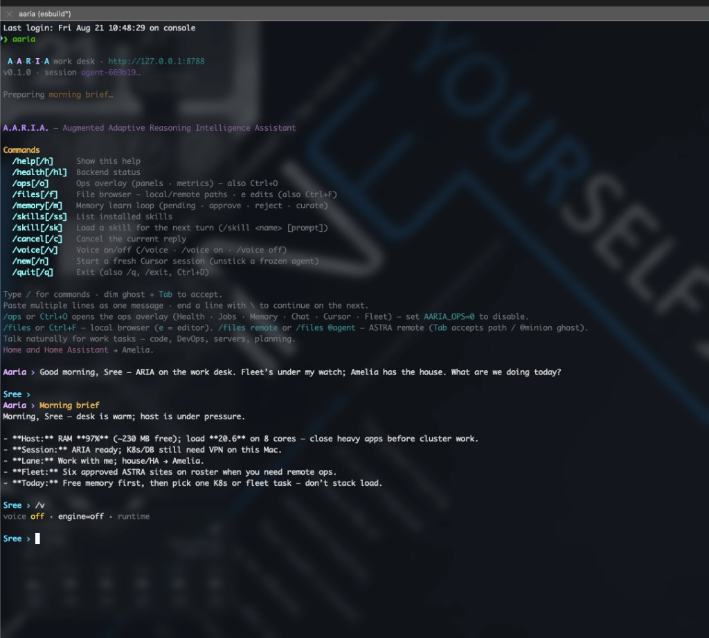
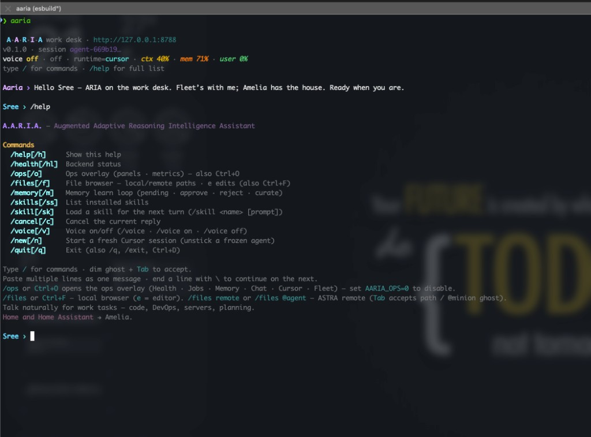

# Release notes — TUI quiet first paint (2026-08-21)

Branch: `feat/tui-quiet-boot`  
Design: [`docs/superpowers/specs/2026-08-21-aaria-tui-quiet-boot-design.md`](../superpowers/specs/2026-08-21-aaria-tui-quiet-boot-design.md)

## Summary

- **Quieter boot:** banner + status strip + `/help` hint instead of dumping the full command list
- **Status strip:** voice · runtime · heat (ctx / mem / user)
- **Morning brief:** buffered and styled once complete (no raw `**markdown**` mid-stream)
- **Voice off by default** on this host (`AARIA_VOICE=0`); TUI skips Piper warmup when muted
- Full command reference remains on `/help`

## Before

Dense first paint: formal name expansion, full slash-command dump, long hint wall, then chat.

## After

Chat-first boot with compact status and on-demand `/help`.

